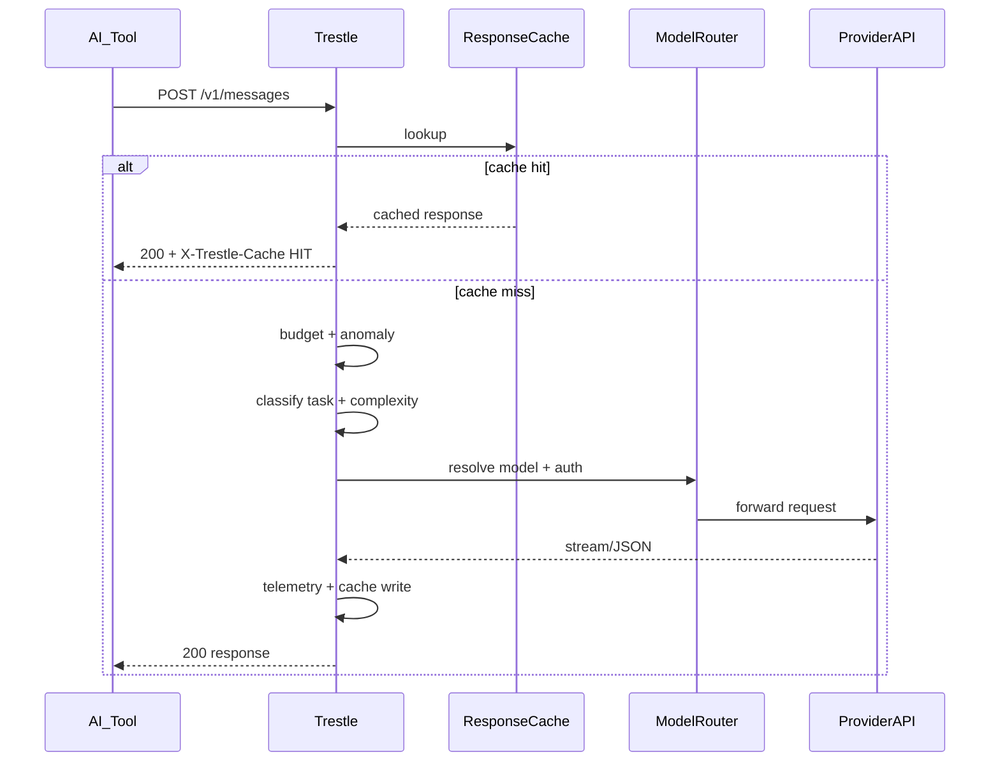

# Request Flow — Trestle Proxy

Step-by-step path for a typical `POST /v1/messages` request. Implementation lives primarily in `src/standalone-proxy.ts`.

## 1. Client configuration

The AI tool sets:

```bash
export ANTHROPIC_BASE_URL=http://localhost:4100
# or
export OPENAI_BASE_URL=http://localhost:4100
```

The tool sends the same JSON it would send to Anthropic/OpenAI. The proxy is API-compatible for Messages and Chat Completions, including streaming and tool use.

## 2. Intercept

Proxy HTTP server receives the request on port **4100** (CLI default). `RequestContext` captures:

- Incoming auth (`x-api-key` or `Authorization`)
- `user-agent`, `x-app` (required for Claude Max OAuth validation)
- `anthropic-version`, `anthropic-beta` headers
- Request body (`model`, `messages`, `stream`, `tools`, …)

## 3. Pre-provider middleware chain

```text
Cache lookup
  └─ HIT → return cached JSON/SSE (skip provider)
Budget check
  └─ breach → block | warn | downgrade model | alert
Anomaly check
  └─ loop/spike → alert, optional block
```

Modules: `response-cache.ts`, `budget.ts`, `anomaly.ts`, `downgrade.ts`.

## 4. Analyze & classify

Always executed (even in passthrough) for dashboard and telemetry:

```typescript
// Simplified — see standalone-proxy.ts ~5376
promptText = extractMessageText(messages);
taskType = inferTaskType(promptText);           // @relayplane/core
complexity = classifyComplexity(messages);      // simple | moderate | complex
```

**Task type** — heuristic labels for telemetry (`tool_use`, `quick_task`, …).

**Complexity** — drives routing when `routing.mode` is `auto`, `complexity`, or `cascade`:

- Last **user** message: keyword patterns, code blocks, token estimate
- Full conversation: context size floor, message count

## 5. Route model

Decision tree (simplified):

```text
modelOverrides[requestedModel]?
  → use override
requestedModel is rp:fast | relayplane:auto | :cost suffix?
  → resolve alias / preference
routing.mode === 'auto' | 'complexity' | 'cascade'?
  → map complexity tier to configured model
  → OR walk cascade list with escalation on uncertainty/refusal
policy.yaml match for agent fingerprint / task type?
  → use policy preferred model
else
  → passthrough (requested model unchanged)
```

Config gate at ~5313: when `routing.mode` is `auto`/`complexity`/`cascade`, overrides client passthrough intent.

Logging: `routing-log.ts` ring buffer + JSONL.

## 6. Select auth

For Anthropic forwards:

```text
getAuthForModel(targetModel, authConfig, envApiKey)
buildAnthropicHeadersWithAuth(ctx, apiKey, isMaxToken, isRerouted)
```

Priority:

1. Incoming client token (passthrough)
2. Hybrid auth `auth.anthropicMaxToken` for models matching `useMaxForModels`
3. `ANTHROPIC_API_KEY` env
4. Token pool entry from `providers.anthropic.accounts[]`

**OAuth limitation:** Haiku rejects `sk-ant-oat*`. Auto-route to Haiku requires env API key.

## 7. Forward

`forwardNativeAnthropicRequest()` or OpenAI equivalent:

- Rewrites `model` in body to routed model
- Forwards stream chunks unchanged to client
- Observes provider errors (401, 429, 529) for pool/cooldown/cross-provider cascade

Cross-provider fallback: `cross-provider-cascade.ts` on 429/529/503.

## 8. Response & record

- Set debug headers (`X-Trestle-Cache`, routed model metadata)
- Cache response if policy allows
- `recordTelemetry()` — local + optional cloud queue
- Update `budget.ts`, `agent-tracker.ts` (system prompt fingerprint), `cost-ledger.ts`
- Mesh capture if enabled (`mesh/capture.ts`)

## 9. Client receives response

Client sees a normal Anthropic/OpenAI response. Model field may differ from what the client requested if routing was active.

## Debugging a routing decision

1. Start with `trestle start --verbose`
2. Check dashboard request row — requested vs routed model
3. Read `~/.trestle/routing-log.jsonl` if enabled
4. Curl with intentional simple prompt to force Haiku in auto mode
5. Verify auth: OAuth clients need `ANTHROPIC_API_KEY` for Haiku routes

## Sequence diagram


