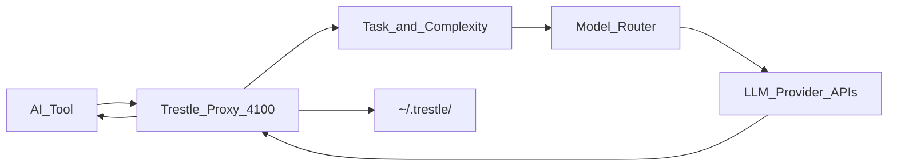

# Trestle Proxy — Agent Instructions

Local fork of [@trestle/proxy](https://www.npmjs.com/package/@trestle/proxy) — a Node.js LLM proxy that sits between AI tools (Cursor, Claude Code, OpenClaw, Aider) and provider APIs. Drop-in via `ANTHROPIC_BASE_URL` / `OPENAI_BASE_URL` pointing at `http://localhost:4100`.

**Official docs:** [relayplane.com/docs](https://relayplane.com/docs) · [How it works](https://relayplane.com/docs/proxy/how-it-works) · [npm package](https://www.npmjs.com/package/@trestle/proxy)

**Deep context:** [.ai/guidelines/](.ai/guidelines/)

## Project goal

Intercept OpenAI/Anthropic-compatible API calls, optionally route them to cheaper or better-fit models using **local heuristics** (no LLM calls for classification), track cost/telemetry locally, and forward prompts **directly to providers** — never through Trestle servers.

Default behavior is **passthrough**: requests use the model the client requested. Routing (complexity, cascade, auto, overrides) is opt-in via `~/.trestle/config.json`.

## Stack

| Item | Value |
|------|-------|
| Runtime | Node.js ≥ 18 |
| Language | TypeScript (ESM, `.js` import suffixes) |
| Package manager | **pnpm** (not npm/yarn) |
| Test runner | Vitest |
| Build | `tsc` → `dist/` |
| Default CLI port | 4100 |

## Commands

```bash
cd /path/to/proxy
pnpm install
pnpm run build       # required before start/test
pnpm run dev         # tsc --watch
pnpm start           # node dist/cli.js
pnpm test            # tsc && vitest run (primary)
pnpm run test:watch
pnpm run test:integration
pnpm run test:e2e
```

**Global install from this fork:** `pnpm run build && npm pack` then `npm install -g ./trestle-proxy-*.tgz`. Tarballs in repo root are stale unless rebuilt.

## Architecture



### Request pipeline (hot path in `standalone-proxy.ts`)

1. Parse request (`/v1/messages`, `/v1/chat/completions`, …)
2. Response cache lookup (exact / aggressive)
3. Budget check → block / warn / downgrade / alert
4. Anomaly detection (loops, spikes)
5. Auto-downgrade if budget threshold exceeded
6. Classify task type + complexity (always, for telemetry)
7. Select route/model (passthrough, overrides, complexity, cascade, policy)
8. Forward to provider with correct auth headers
9. Stream or return response; cache if enabled
10. Record telemetry, update budget, mesh sync (if enabled)

### Entry points

| File | Role |
|------|------|
| [`src/cli.ts`](src/cli.ts) | CLI (`relayplane`, `trestle-proxy`): `init`, `start`, `status`, `telemetry`, `budget`, `mesh`, `policy`, `ensure-running`, … |
| [`src/standalone-proxy.ts`](src/standalone-proxy.ts) | **Main HTTP server** (~7k lines): routing, auth, dashboard, caching, forwarding |
| [`src/index.ts`](src/index.ts) | Library exports (`startProxy`, config, telemetry, middleware) |
| [`src/config.ts`](src/config.ts) | `~/.trestle/config.json` schema and persistence |
| [`src/telemetry.ts`](src/observability/telemetry.ts) | Local + cloud telemetry; `inferTaskType` from token patterns |
| [`src/agent-policy.ts`](src/routing/policy.ts) | `~/.trestle/policy.yaml` per-agent routing |
| [`src/server.ts`](src/server.ts) | Optional advanced server (`@relayplane/routing-engine`, etc.) — **excluded from `tsc` build** |

### Module map (by concern)

- **Routing:** `standalone-proxy.ts`, `routing-log.ts`, `cross-provider-cascade.ts`, `downgrade.ts`, `policy-analyzer.ts`, `helpers/config-loader.ts`
- **Auth / credentials:** `token-pool.ts`, `credential-pool.ts`, `credentials.ts` — OAuth (`sk-ant-oat*`) vs API key (`sk-ant-api*`)
- **Cost / limits:** `budget.ts`, `cost-ledger.ts`, `alerts.ts`, `anomaly.ts`, `rate-limiter.ts`
- **Observability:** `telemetry.ts`, `stats.ts`, `agent-tracker.ts`, `session-tracker.ts`, `trace-writer.ts`
- **Resilience:** `circuit-breaker.ts`, `recovery.ts`, `response-cache.ts`, `kill-switch.ts`
- **Mesh / learning:** `mesh/`, `osmosis-store.ts`, `mesh.ts`
- **Sandbox:** `middleware.ts`, `process-manager.ts`, `launcher.ts`

## Core concepts

### Task detection (metadata only)

Classification uses **request characteristics**, not stored prompt content for cloud telemetry:

- Token counts in/out, tool presence, input/output ratio
- Task types: `tool_use`, `quick_task`, `long_context`, `generation`, `classification`, `code_review`, `general`
- Implemented in `@relayplane/core` (`inferTaskType`) and [`src/observability/telemetry.ts`](src/observability/telemetry.ts) (token-pattern variant)

### Complexity routing

[`classifyComplexity()`](src/standalone-proxy.ts) scores the **last user message** (not system prompts — agent SOUL/AGENTS.md would skew everything to complex). Also considers total context size and message count.

Tiers: `simple` → Haiku, `moderate` → Sonnet, `complex` → Opus (configurable in `routing.complexity`).

When `routing.mode` is `auto`, `complexity`, or `cascade`, config overrides client-requested model names.

### Routing modes (`config.json`)

| Mode | Behavior |
|------|----------|
| (default / passthrough) | Forward requested model unchanged |
| `complexity` | Route by simple/moderate/complex tiers |
| `cascade` | Start cheap; escalate on uncertainty/refusal/error |
| `auto` | Classify all requests and route by complexity |

Also: `modelOverrides`, smart aliases (`rp:fast`, `relayplane:auto`), suffixes (`:cost`, `:fast`, `:quality`).

### Auth (Anthropic)

| Token | Header | Models |
|-------|--------|--------|
| API key `sk-ant-api*` | `x-api-key` | All |
| OAuth/Max `sk-ant-oat*` | `Authorization: Bearer` + oauth beta | Opus, Sonnet — **not Haiku** |

**Known gap:** Auto-routing Opus → Haiku with OAuth-only clients fails unless `ANTHROPIC_API_KEY` is set for Haiku. See [AUTO-ROUTING-NOTES.md](AUTO-ROUTING-NOTES.md). Fix belongs in `getAuthForModel()` / `buildAnthropicHeadersWithAuth()` in `standalone-proxy.ts`.

### Credential quarantine

Bad credentials: 2 consecutive 401s → quarantine ~1h → fallback to next pool entry. Multi-account pool: `providers.anthropic.accounts[]` in config.

### Local storage (`~/.trestle/`)

| Path | Purpose |
|------|---------|
| `config.json` | Routing, providers, budget, mesh, telemetry flags |
| `policy.yaml` | Per-agent / per-task overrides |
| `stats.json` | Usage aggregates |
| `telemetry.jsonl` | Local telemetry log |
| `telemetry/` | Queued cloud upload batches |

Override config path: `TRESTLE_CONFIG_PATH`.

### Privacy

- Prompts go **directly to LLM providers**
- Cloud telemetry (on by default): anonymous metadata only — model, tokens, cost, latency, task_type
- Disable: `trestle telemetry off` · offline: `trestle start --offline` · mesh: `trestle mesh off`

**Deep context:** [.ai/guidelines/](.ai/guidelines/) — [providers.md](.ai/guidelines/providers.md), [docker.md](.ai/guidelines/docker.md)

## Docker

```bash
cp .env.example .env && docker compose up -d --build
```

Config volume: `trestle-data` → `/root/.relayplane`. Binds `0.0.0.0:4100`.

## New providers (this fork)

| Provider | Module | Notes |
|----------|--------|-------|
| DeepSeek | `src/providers/deepseek.ts` | Dedicated module: v4-flash/pro, prefix completion, KV cache pricing — [docs/providers/deepseek.md](docs/providers/deepseek.md) |
| z.ai / GLM | `src/providers/zai.ts` | Dedicated module: thinking, multimodal, tools/media/agents — [docs/providers/zai.md](docs/providers/zai.md) |
| Ollama Cloud | `src/providers/ollama-cloud.ts` | Dedicated module: native `/api/*`, think support, Anthropic-compat — [docs/providers/ollama-cloud.md](docs/providers/ollama-cloud.md) |
| NVIDIA NIM | `src/providers/nvidia.ts` | Dedicated module: Nemotron reasoning, embeddings, reranking — [docs/providers/nvidia.md](docs/providers/nvidia.md) |
| Mistral | `src/providers/shared.ts` | OpenAI-compatible via `forwardOpenAiCompatible` |
| Azure Foundry | `src/providers/azure-foundry.ts` | `@azure/ai-projects` SDK + legacy API-key — [docs/providers/azure-foundry.md](docs/providers/azure-foundry.md) |
| GitHub Copilot | `src/providers/copilot.ts` | Dedicated module: SDK CLI client, sticky sessions — [docs/providers/copilot.md](docs/providers/copilot.md) |
| Kimi / Moonshot | `src/providers/kimi.ts` | Cloud OpenAI-compatible chat + balance/models/files — [docs/providers/kimi.md](docs/providers/kimi.md) |
| Kimi Agent SDK | `src/providers/kimi-agent.ts` | Local `kimi` CLI via `@moonshot-ai/kimi-agent-sdk` — [docs/providers/kimi-agent.md](docs/providers/kimi-agent.md) |
| Qwen / DashScope | `src/providers/qwen.ts` | Cloud OpenAI-compatible chat + models — [docs/providers/qwen.md](docs/providers/qwen.md) |
| Qwen Agent SDK | `src/providers/qwen-agent.ts` | Local Qwen Code via `@qwen-code/sdk` — [docs/providers/qwen-agent.md](docs/providers/qwen-agent.md) |
| OpenRouter | `src/providers/openrouter.ts` | Dedicated module: `@openrouter/sdk` chat + metadata routes — [docs/providers/openrouter.md](docs/providers/openrouter.md) |
| OpenCode Zen | `src/providers/opencode-zen.ts` | Multi-protocol Zen forwarding — [docs/providers/opencode-zen.md](docs/providers/opencode-zen.md) |
| OpenCode Go | `src/providers/opencode-go.ts` | Go tier forwarding — [docs/providers/opencode-go.md](docs/providers/opencode-go.md) |
| OpenCode server | `src/providers/opencode.ts` | `@opencode-ai/sdk` agent server client — [docs/providers/opencode.md](docs/providers/opencode.md) |
| Google ADK | `src/providers/google-adk.ts` | `@google/adk` LlmAgent + Runner — [docs/providers/google-adk.md](docs/providers/google-adk.md) |
| Antigravity | `src/providers/antigravity.ts` | Managed agent via Gemini Interactions API — [docs/providers/antigravity.md](docs/providers/antigravity.md) |
| AGY | `src/providers/agy.ts` | Antigravity-style ADK coding agent — [docs/providers/agy.md](docs/providers/agy.md) |
| Ollama (local) | `src/providers/ollama.ts` | Native adapter |
| Devin | `src/providers/devin.ts` | Dedicated module: v3 sessions, knowledge, metrics, consumption — [docs/providers/devin.md](docs/providers/devin.md) |
| Cursor team API | `src/providers/cursor.ts` | Admin, Analytics, AI Code Tracking — [docs/providers/cursor.md](docs/providers/cursor.md) |
| Codex | `src/api/responses.ts` | `POST /v1/responses` |
| DeepSeek metadata | `src/api/deepseek-routes.ts` | `GET /v1/providers/deepseek/{balance,models}` |
| z.ai metadata | `src/api/zai-routes.ts` | `POST/GET /v1/providers/zai/*` (tokenizer, web-search, reader, OCR, image, video, audio, agents) |
| Ollama Cloud APIs | `src/api/ollama-cloud-routes.ts` | `POST/GET /v1/providers/ollama-cloud/*` (generate, embed, version, tags, ps, show, messages) |
| NVIDIA NIM APIs | `src/api/nvidia-routes.ts` | `POST/GET /v1/providers/nvidia/*` (embeddings, ranking, models) |
| Devin v3 APIs | `src/api/devin-routes.ts` | `POST/GET /v1/providers/devin/*` (sessions, PR reviews, knowledge, playbooks, secrets, repositories, schedules, metrics, consumption) |
| Cursor team APIs | `src/api/cursor-routes.ts` | `GET/POST/PATCH/DELETE /v1/providers/cursor/*` (teams, settings, analytics, ai-code tracking) |
| Copilot SDK APIs | `src/api/copilot-routes.ts` | `POST/GET /v1/providers/copilot/*` (ping, sessions, messages, events, abort) |
| Kimi cloud APIs | `src/api/kimi-routes.ts` | `POST/GET /v1/providers/kimi/*` (ping, balance, models, estimate, files) |
| Kimi Agent APIs | `src/api/kimi-agent-routes.ts` | `POST/GET /v1/providers/kimi-agent/*` (ping, config, sessions, prompt, MCP) |
| Qwen cloud APIs | `src/api/qwen-routes.ts` | `GET /v1/providers/qwen/*` (ping, models) |
| Qwen Agent APIs | `src/api/qwen-agent-routes.ts` | `POST/GET /v1/providers/qwen-agent/*` (ping, query, sessions, control) |
| OpenRouter APIs | `src/api/openrouter-routes.ts` | `GET/POST /v1/providers/openrouter/*` (models, credits, generations, embeddings, providers) |
| OpenCode server APIs | `src/api/opencode-routes.ts` | `POST/GET /v1/providers/opencode/*` (ping, config, sessions, find, file, events) |
| OpenCode Zen APIs | `src/api/opencode-zen-routes.ts` | `GET /v1/providers/opencode-zen/models` |
| OpenCode Go APIs | `src/api/opencode-go-routes.ts` | `GET /v1/providers/opencode-go/models` |
| Google ADK APIs | `src/api/google-adk-routes.ts` | `POST/GET /v1/providers/google-adk/*` (sessions, run) |
| Antigravity APIs | `src/api/antigravity-routes.ts` | `POST/GET /v1/providers/antigravity/*` (interactions) |
| AGY APIs | `src/api/agy-routes.ts` | `POST/GET /v1/providers/agy/*` (sessions, run) |
| Azure Foundry APIs | `src/api/azure-foundry-routes.ts` | `POST/GET /v1/providers/azure-foundry/*` (deployments, connections, datasets, agents, beta) |

Registry: `DEFAULT_ENDPOINTS` in [src/providers/registry.ts](src/providers/registry.ts). Config override: `providers.<name>.baseUrl` in `config.json`.

## API surface

| Endpoint | Notes |
|----------|-------|
| `POST /v1/messages` | Anthropic Messages API |
| `POST /v1/chat/completions` | OpenAI Chat Completions |
| `POST /v1/responses` | OpenAI Responses API (Codex CLI) |
| `GET /v1/providers/deepseek/balance` | DeepSeek account balance |
| `GET /v1/providers/deepseek/models` | DeepSeek model list |
| `POST /v1/providers/zai/tokenizer` | z.ai token counting |
| `POST /v1/providers/zai/web-search` | z.ai web search tool |
| `POST /v1/providers/zai/reader` | z.ai web reader |
| `POST /v1/providers/zai/layout-parsing` | z.ai GLM-OCR layout parsing |
| `POST /v1/providers/zai/images/generations` | z.ai image generation |
| `GET /v1/providers/zai/async-result/:id` | z.ai async image/video result |
| `POST /v1/providers/ollama-cloud/generate` | Ollama Cloud native generate (NDJSON) |
| `POST /v1/providers/ollama-cloud/embed` | Ollama Cloud embeddings |
| `GET /v1/providers/ollama-cloud/{version,tags,ps}` | Ollama Cloud metadata |
| `POST /v1/providers/ollama-cloud/{show,messages}` | Model info / Anthropic-compat messages |
| `POST /v1/providers/nvidia/embeddings` | NVIDIA NIM embeddings |
| `POST /v1/providers/nvidia/ranking` | NVIDIA NIM NeMo Retriever reranking |
| `GET /v1/providers/nvidia/models` | NVIDIA NIM model list |
| `GET /v1/providers/devin/self` | Devin service-user identity |
| `GET/POST /v1/providers/devin/sessions` | Devin session list / create |
| `GET/DELETE /v1/providers/devin/sessions/:id` | Devin session get / terminate |
| `POST/GET /v1/providers/devin/sessions/:id/messages` | Devin session messages |
| `POST /v1/providers/devin/sessions/:id/archive` | Archive Devin session |
| `GET/POST/PUT /v1/providers/devin/sessions/:id/tags` | Devin session tags |
| `GET/POST /v1/providers/devin/pr-reviews` | Devin PR reviews |
| `GET/POST/PUT/DELETE /v1/providers/devin/knowledge/notes` | Devin knowledge notes |
| `GET /v1/providers/devin/knowledge/folders` | Devin knowledge folder tree |
| `GET/POST/PUT/DELETE /v1/providers/devin/playbooks` | Devin playbooks |
| `GET/POST/DELETE /v1/providers/devin/secrets` | Devin secrets |
| `GET/PUT/DELETE /v1/providers/devin/repositories/*` | Devin repository indexing |
| `GET/POST/PATCH/DELETE /v1/providers/devin/schedules` | Devin schedules |
| `GET /v1/providers/devin/metrics/*` | Devin org metrics (usage, sessions, DAU/WAU/MAU) |
| `GET /v1/providers/devin/consumption/daily/*` | Devin daily ACU consumption |
| `GET/POST/PATCH/DELETE /v1/providers/cursor/teams/*` | Cursor Admin (members, usage, spend, groups) |
| `GET/POST/DELETE /v1/providers/cursor/settings/*` | Cursor repo blocklists |
| `GET /v1/providers/cursor/analytics/team/*` | Cursor team analytics (DAU, models, leaderboard, …) |
| `GET /v1/providers/cursor/analytics/by-user/*` | Cursor per-user analytics |
| `GET /v1/providers/cursor/analytics/ai-code/*` | Cursor AI Code Tracking (JSON + CSV) |
| `GET /v1/providers/copilot/ping` | Copilot SDK health ping |
| `GET/POST /v1/providers/copilot/sessions` | Copilot session list / create |
| `POST /v1/providers/copilot/sessions/:id/resume` | Resume Copilot session |
| `DELETE /v1/providers/copilot/sessions/:id` | Delete Copilot session |
| `GET /v1/providers/copilot/sessions/:id/events` | Copilot session events |
| `POST /v1/providers/copilot/sessions/:id/messages` | Send message (wait / stream / fire-and-forget) |
| `POST /v1/providers/copilot/sessions/:id/abort` | Abort Copilot session |
| `GET /v1/providers/kimi/ping` | Kimi / Moonshot health probe |
| `GET /v1/providers/kimi/balance` | Moonshot account balance |
| `GET /v1/providers/kimi/models` | Moonshot model list |
| `POST /v1/providers/kimi/tokenizers/estimate-token-count` | Moonshot token estimate |
| `POST/GET /v1/providers/kimi/files/*` | Moonshot files API |
| `GET /v1/providers/kimi-agent/ping` | Kimi CLI + SDK probe |
| `GET /v1/providers/kimi-agent/config` | Parsed kimi CLI config |
| `GET/POST /v1/providers/kimi-agent/sessions` | Kimi Agent session list / create |
| `GET /v1/providers/kimi-agent/sessions/:id/events` | Replay session events |
| `DELETE /v1/providers/kimi-agent/sessions/:id` | Delete Kimi Agent session |
| `POST /v1/providers/kimi-agent/sessions/:id/prompt` | Prompt session (wait / stream) |
| `POST /v1/providers/kimi-agent/sessions/:id/interrupt` | Interrupt active turn |
| `POST /v1/providers/kimi-agent/sessions/:id/approve` | Approve tool request |
| `POST /v1/providers/kimi-agent/mcp/:name/*` | Kimi MCP auth / test |
| `GET /v1/providers/qwen/ping` | Qwen / DashScope health probe |
| `GET /v1/providers/qwen/models` | DashScope model list |
| `GET /v1/providers/qwen-agent/ping` | Qwen Code SDK probe |
| `POST /v1/providers/qwen-agent/query` | One-shot `query()` (wait / stream) |
| `POST /v1/providers/qwen-agent/sessions` | Start Qwen agent session |
| `POST /v1/providers/qwen-agent/sessions/:id/prompt` | Prompt session (wait / stream) |
| `POST /v1/providers/qwen-agent/sessions/:id/interrupt` | Interrupt active query |
| `POST /v1/providers/qwen-agent/sessions/:id/permission-mode` | Set permission mode |
| `POST /v1/providers/qwen-agent/sessions/:id/model` | Set model on active query |
| `GET /v1/providers/qwen-agent/sessions/:id/context-usage` | Context usage |
| `GET /v1/providers/qwen-agent/sessions/:id/mcp-status` | MCP server status |
| `GET /v1/providers/qwen-agent/sessions/:id/commands` | Supported slash commands |
| `DELETE /v1/providers/qwen-agent/sessions/:id` | Close session |
| `GET /v1/providers/openrouter/models` | OpenRouter model list |
| `GET /v1/providers/openrouter/models/count` | OpenRouter model count |
| `GET /v1/providers/openrouter/models/:author/:slug` | OpenRouter model details |
| `GET /v1/providers/openrouter/credits` | OpenRouter credit balance |
| `GET /v1/providers/openrouter/generations/:id` | OpenRouter generation metadata |
| `GET /v1/providers/openrouter/generations/:id/content` | OpenRouter stored prompt/completion |
| `POST /v1/providers/openrouter/embeddings` | OpenRouter embeddings |
| `GET /v1/providers/openrouter/embeddings/models` | OpenRouter embedding models |
| `GET /v1/providers/openrouter/providers` | OpenRouter upstream providers list |
| `GET /v1/providers/opencode/ping` | OpenCode server health |
| `GET /v1/providers/opencode/config` | OpenCode server config |
| `GET/POST /v1/providers/opencode/sessions` | OpenCode session list / create |
| `POST /v1/providers/opencode/sessions/:id/prompt` | OpenCode session prompt |
| `GET /v1/providers/opencode/events` | OpenCode SSE events |
| `GET /v1/providers/opencode-zen/models` | OpenCode Zen model list |
| `GET /v1/providers/opencode-go/models` | OpenCode Go model list |
| `GET /v1/providers/google-adk/ping` | Google ADK version |
| `GET/POST /v1/providers/google-adk/sessions` | ADK session list / create |
| `GET/DELETE /v1/providers/google-adk/sessions/:id` | ADK session get / delete |
| `POST /v1/providers/google-adk/sessions/:id/run` | Run ADK agent in session |
| `POST /v1/providers/google-adk/run` | ADK ephemeral one-shot run |
| `GET /v1/providers/antigravity/ping` | Antigravity agent health |
| `POST /v1/providers/antigravity/interactions` | Create Antigravity interaction |
| `GET/DELETE /v1/providers/antigravity/interactions/:id` | Get / cancel interaction |
| `GET /v1/providers/agy/ping` | AGY client health |
| `GET/POST /v1/providers/agy/sessions` | AGY session list / create |
| `GET/DELETE /v1/providers/agy/sessions/:id` | AGY session get / delete |
| `POST /v1/providers/agy/sessions/:id/run` | Run AGY agent in session |
| `GET /v1/providers/azure-foundry/ping` | Foundry project health |
| `GET /v1/providers/azure-foundry/deployments` | List model deployments |
| `GET /v1/providers/azure-foundry/connections` | List project connections |
| `GET/POST /v1/providers/azure-foundry/agents` | List / create agent versions |
| `POST /v1/providers/azure-foundry/responses` | Native Foundry Responses API |
| `GET/POST /v1/providers/azure-foundry/beta/agents/:name/sessions` | Beta hosted agent sessions |
| `GET /v1/providers/azure-foundry/beta/skills` | Beta skills list |
| `GET /health` | Health + uptime |
| `GET /dashboard` | Local cost UI |
| `GET /v1/telemetry/stats` | Aggregate stats JSON |
| `GET /v1/token-pool/status` | Multi-account pool health |

Response headers include routing debug info (e.g. `X-Trestle-Cache`, routed model).

## Development workflow

### Before changing routing or auth

1. Read [AUTO-ROUTING-NOTES.md](AUTO-ROUTING-NOTES.md) for OAuth/Haiku edge cases
2. Locate logic in `standalone-proxy.ts` (~lines 1429 classify, 1503 auth, 5313 routing mode)
3. Add unit tests under `__tests__/` (mirror existing patterns: `complexity-routing.test.ts`, `token-pool.test.ts`)
4. Run `pnpm test` — Vitest uses single-fork pool to avoid port conflicts

### Adding a feature

1. Prefer small, focused modules over growing `standalone-proxy.ts` further
2. Export public API from `index.ts` only when needed for library consumers
3. Config schema changes → update `config.ts` + defaults + dashboard if applicable
4. Document user-facing behavior in README; document agent/internals in `.ai/guidelines/`

### Debugging

```bash
trestle start --verbose
trestle start --audit      # inspect telemetry before send
trestle status
curl http://localhost:4100/health
```

Dashboard: `http://localhost:4100` · Config UI: `/dashboard/config`

### Tests layout

- `__tests__/*.test.ts` — unit tests (60+ files)
- `__tests__/integration/` — proxy e2e
- `test/e2e/` — setup flow tests

## In-progress / fork notes

- **Auto-routing + OAuth:** See [AUTO-ROUTING-NOTES.md](AUTO-ROUTING-NOTES.md) — model-aware auth selection not fully shipped
- `src/server.ts` / `src/streaming.ts` excluded from build (`tsconfig.json`) — use `standalone-proxy.ts` for production path
- Rebuild `dist/` after source edits; global tarball installs do not auto-compile

## Conventions

- ESM imports use `.js` extension (`import { x } from './foo.js'`)
- Use **pnpm** exclusively
- Do not commit `node_modules/`, `dist/` (unless release process requires), or secrets
- Larastan/Pint N/A — TypeScript only; run `pnpm test` before PRs

## External references

- Upstream: https://github.com/Trestle/proxy
- Docs index: https://relayplane.com/docs
- How it works: https://relayplane.com/docs/proxy/how-it-works
- npm: https://www.npmjs.com/package/@trestle/proxy
